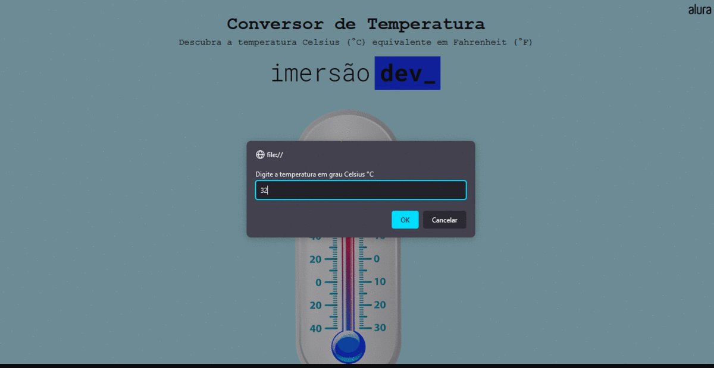

<h1 align="center"> Day 01 Challenge </h1>
<h4 align="center"> 
	Status do Projeto: Concluido :heavy_check_mark:
</h4>

Conversor de temperatura  - (Celsius -> Farenheit).

<h2 align="center"> Projeto em funcionamento </h2>

  

